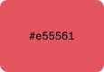
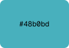
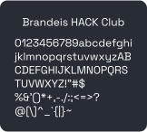

  
  <h1>Brandeis HACK Club Branding</h1>

## Logo

| Preview                                                                                      | Download                               |
| -------------------------------------------------------------------------------------------- | -------------------------------------- |
|                    | [square](./logos/hack-logo.svg)        |
|  | [circle](./logos/hack-logo-circle.svg) |

## Colors

| Preview                                      | Name       | Hex       | HSL                       |
| -------------------------------------------- | ---------- | --------- | ------------------------- |
|  | `red`      | `#e55561` | `hsla(355, 73, 62, 100%)` |
|  | `orange`   | `#dd9046` | `hsla(29, 69, 57, 100%)`  |
|  | `yellow`   | `#e2b86b` | `hsla(39, 67, 65, 100%)`  |
|  | `green`    | `#8ebd6b` | `hsla(94, 38, 58, 100%)`  |
|  | `cyan`     | `#48b0bd` | `hsla(187, 47, 51, 100%)` |
|  | `blue`     | `#4fa6ed` | `hsla(207, 81, 62, 100%)` |
|  | `purple`   | `#bf68d9` | `hsla(286, 60, 63, 100%)` |
|  | `bg-black` | `#000000` | `hsla(0, 0, 0, 100%)`     |
|  | `bg-800`   | `#0e1013` | `hsla(216, 15, 6, 100%)`  |
|  | `bg-700`   | `#1f2329` | `hsla(216, 14, 14, 100%)` |
|  | `bg-600`   | `#282c34` | `hsla(220, 13, 18, 100%)` |
|  | `bg-500`   | `#30363f` | `hsla(216, 14, 22, 100%)` |
|  | `bg-400`   | `#323641` | `hsla(224, 13, 23, 100%)` |
|  | `bg-300`   | `#535965` | `hsla(220, 10, 36, 100%)` |
|  | `bg-200`   | `#7a818e` | `hsla(219, 8, 52, 100%)`  |
|  | `bg-100`   | `#a0a8b7` | `hsla(219, 14, 67, 100%)` |

## Fonts

| Preview                                                                  | Name            |
| ------------------------------------------------------------------------ | --------------- |
|                   | `Geist`         |
|         | `Geist Mono`    |
|  | `Space Grotesk` |

More info about the fonts at <https://fontdrop.info>
